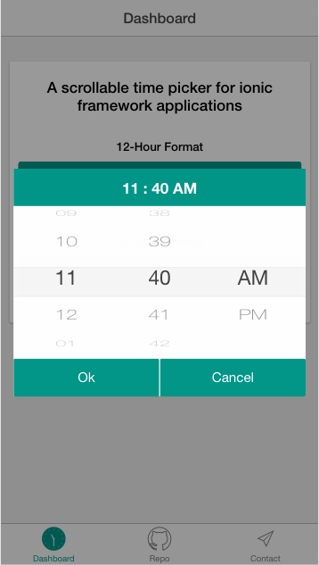

# ionic-scrollable-time-picker
A scrollable time picker for ionic framework applications

[Preview sample](http://aspirewit.com/ionic-scrollable-time-picker-sample/www)

## How to use
1) install plugin via bower

`bower install https://github.com/aspirewit/ionic-scrollable-time-picker.git --save`

2) link CSS and JavaScript file in `index.html`

```
<link href="lib/proton-multi-list-picker/dist/proton.multi-list-picker.css" rel="stylesheet">

<script src="lib/ionic-scrollable-time-picker/dist/ionic-scrollable-time-picker.bundle.min.js"></script>
<script src="lib/proton-multi-list-picker/dist/proton.multi-list-picker.min.js"></script>
```

3) configure plugin in `app.js`

```
angular.module('starter', ['ionic', 'ionic-scrollable-time-picker'])

.config(function(ionicScrollableTimePickerProvider) {

  /*
   * global configurations
   */
  ionicScrollableTimePickerProvider.configTimePicker({
    setButtonText: 'Ok',                // the text for set button, default value is 'Set'
    closeButtonText: 'Cancel',          // the text for close button, default value is 'Close'
    initialDate: new Date(2017, 1, 1),  // the initial date, default value is current date
    format: 12,                         // the hour system, optional value is 12 and 24, default value is 24

    // required, called when the user is done setting a new time
    callback: function(date) {
      console.log('Selected Date:' + date.toString());
    }
  });

});
```

4) open time picker in controller

```
.controller('DashCtrl', function($scope, ionicScrollableTimePicker) {
  ionicScrollableTimePicker.openTimePicker({
    /*
     * override the global configurations
     */
    setButtonText: 'Ok',
    closeButtonText: 'Cancel',
    initialDate: new Date(2017, 1, 1),
    format: 12,

    callback: function(date) {
      console.log('Selected Date:' + date.toString());
    }
  });
})
```

[View sample repo](https://github.com/aspirewit/ionic-scrollable-time-picker-sample)

## Screenshots



## Acknowledgements
* [ionic-timepicker](https://github.com/rajeshwarpatlolla/ionic-timepicker)
  This plugin cites some of it's code implementation
* [proton.multi-list-picker](https://github.com/mmnaseri/proton.multi-list-picker)
  This plugin uses it as a scrollable picker component
